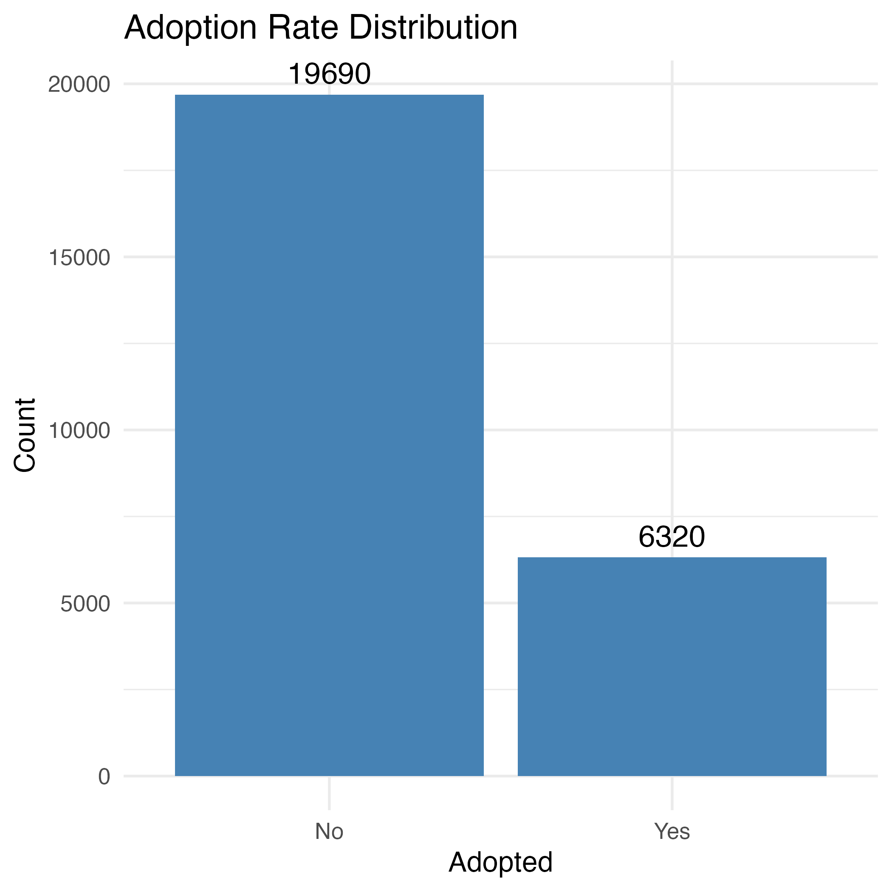
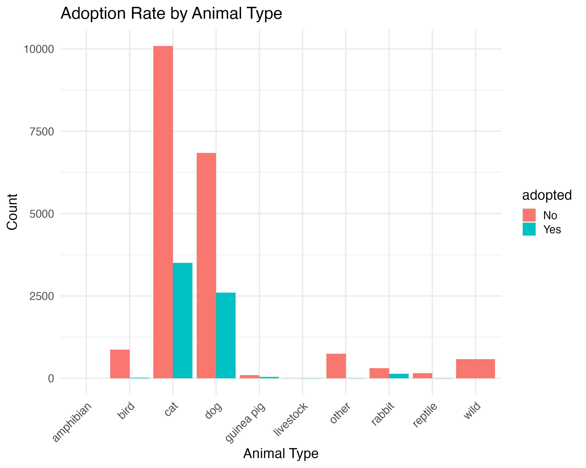
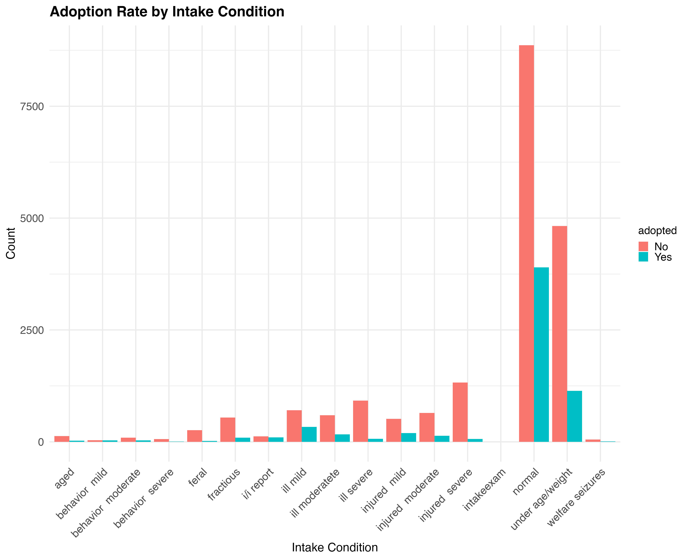
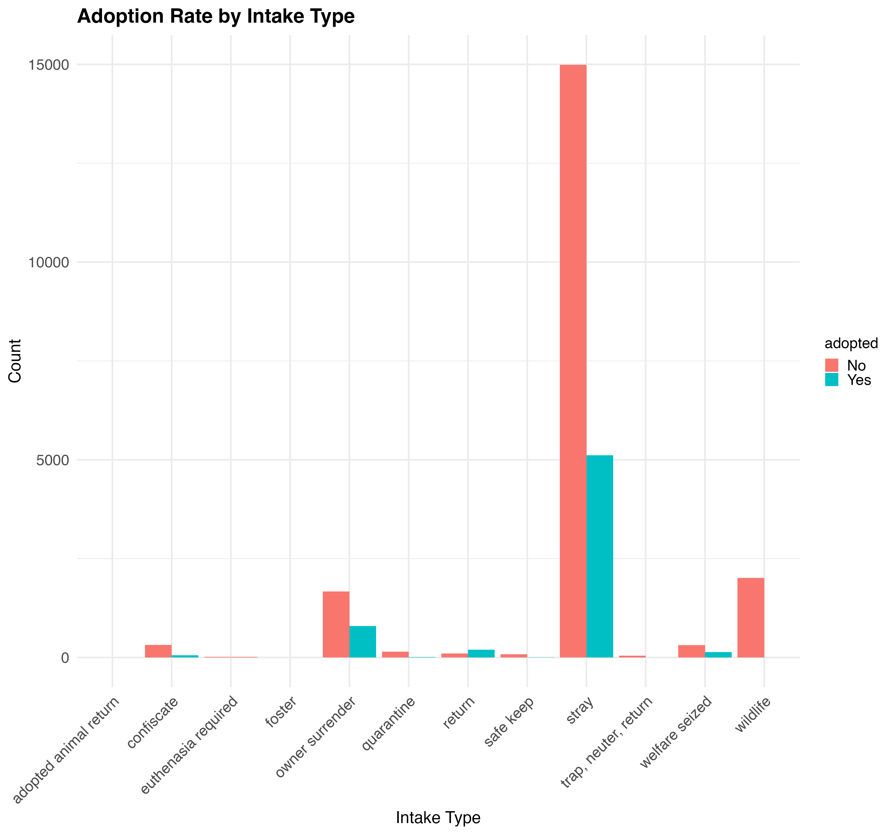
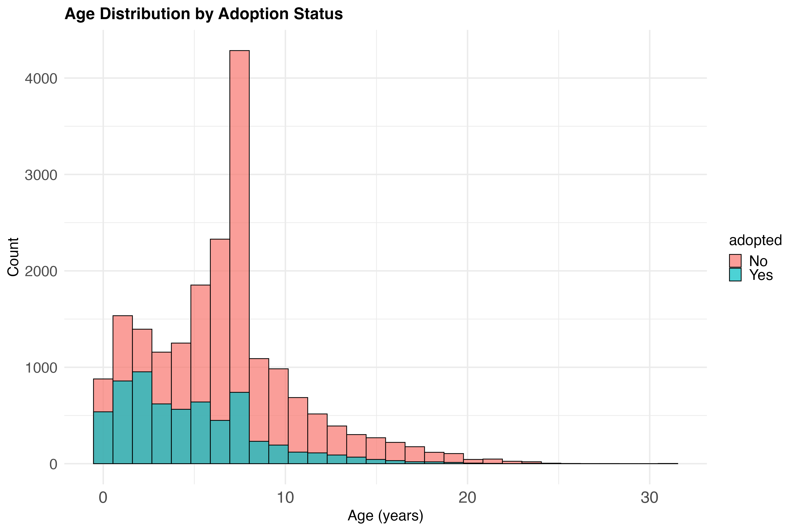
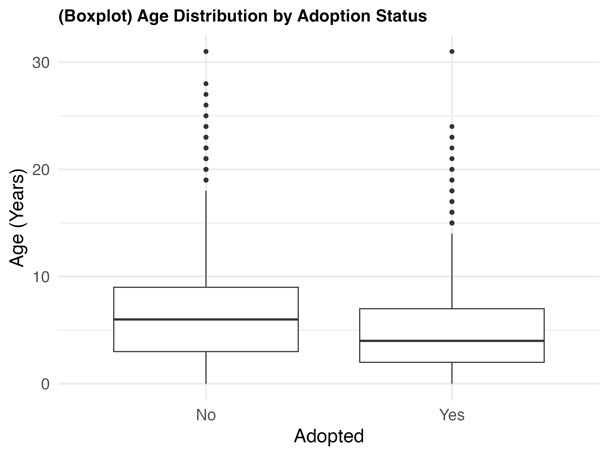
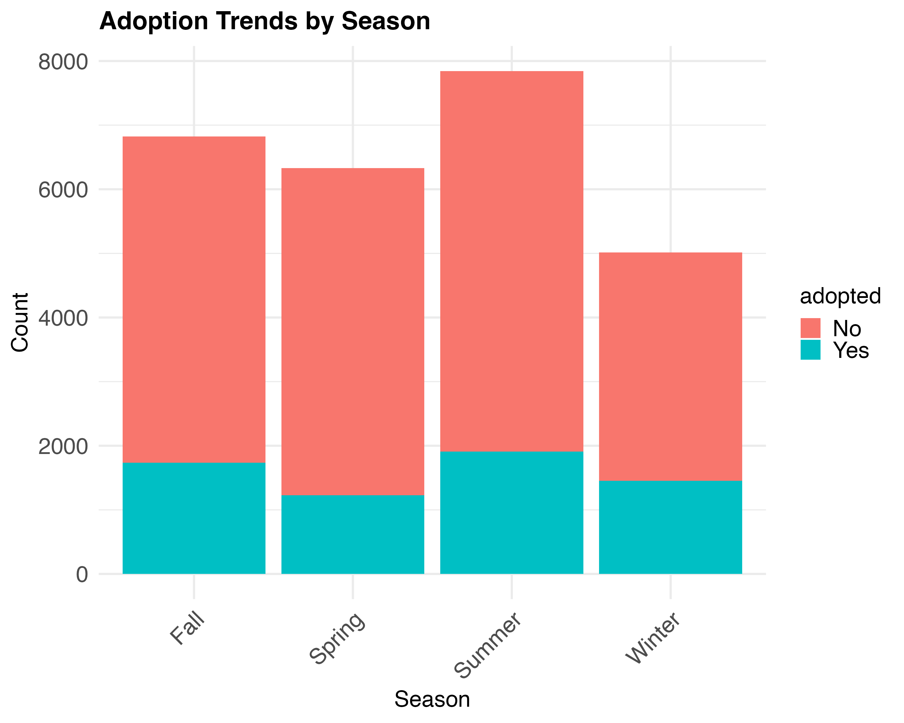

## Summary

Animal adoption is a critical issue for shelters, as many animals experience prolonged stays or never find a permanent home. 
This study aims to build a classification model that predicts whether an animal will be adopted based on its attributes. 
Using data from the [Long Beach Animal Shelter](https://github.com/rfordatascience/tidytuesday/blob/main/data/2025/2025-03-04/readme.md) (@longbeach_dataset), we will analyze key factors such as species, breed, age, health status, and intake type. 
Through exploratory data analysis and predictive modeling, we hope to identify patterns that influence adoption rates.
Our goal is to provide insights that can help shelters improve adoption strategies and increase successful placements.

## Introduction

### Background Information

Animal shelters play a crucial role in rehoming stray and surrendered animals. However, many animals face extended shelter stays, 
leading to overcrowding and resource constraints (@aspca_pet_statistics). 

Recent studies indicate that **adoption rates vary significantly by species, breed, and medical condition** (@zebra_pet_adoption_stats). 
Understanding what factors influence adoption can help shelters make data-driven decisions to improve adoption rates. 

In recent years, data-driven approaches have been applied to predict adoption outcomes, allowing shelters to prioritize resources 
and create targeted adoption campaigns (@bmc_vet_research). 
Previous studies have shown that characteristics such as species, age, breed, and health status 
can significantly impact adoption likelihood (@drpress_pet_adoption). 
By leveraging machine learning techniques, we aim to develop a model that predicts
whether an animal will be adopted based on its attributes.

### Problem Statement

Can we predict whether an animal will be adopted based on its attributes? 
This study aims to address this question using a classification model trained on animal shelter intake and outcome data. 
Specifically, we will classify each animal as either **adopted (Yes) or not adopted (No)** using key features such as species, 
age, breed, and medical conditions. 

By understanding which features are most important in predicting adoption, we can provide actionable insights to shelters 
to increase adoption rates and improve animal welfare.

### Dataset Description

The dataset used in this study comes from the **TidyTuesday project** and contains **animal intake and outcome records** from the **Long Beach Animal Shelter**. The dataset provides details on each animal’s characteristics, the reason for intake, and the outcome of their stay at the shelter.

This dataset is publicly available and can be accessed here:  
[@longbeach_dataset](https://github.com/rfordatascience/tidytuesday/blob/main/data/2025/2025-03-04/readme.md).


```{r}
# Load necessary libraries
library(tidyverse)
# Load processed data for inline code references
longbeach <- read_csv("../data/raw/longbeach.csv")
cleaned_data <- read_csv("../data/processed/longbeach_cleaned.csv")
transformed_data <- read_csv("../data/processed/longbeach_transformed.csv")
# Extract min and max dates from intake_date and outcome_date
min_date <- min(as.Date(longbeach$intake_date, na.rm = TRUE), 
                as.Date(longbeach$outcome_date, na.rm = TRUE), na.rm = TRUE)
max_date <- max(as.Date(longbeach$intake_date, na.rm = TRUE), 
                as.Date(longbeach$outcome_date, na.rm = TRUE), na.rm = TRUE)

# Format the dates as years
min_year <- format(min_date, "%Y")
max_year <- format(max_date, "%Y")
```

The original dataset consists of `r format(nrow(longbeach), big.mark=",")` records with `r ncol(longbeach)` variables describing animal shelter operations from `r min_year` to `r max_year`.

#### Key Variables

Below are some of the key variables from the original dataset and are relevant to predicting adoption outcomes:

```{r}
#| label: tbl-key-variables
#| tbl-cap: Key Variables Used in Analysis

# Create a data frame of key variables
key_vars <- data.frame(
  Variable = c("animal_type", "sex", "dob", "intake_condition", 
               "intake_type", "outcome_date", "outcome_type"),
  Description = c(
    "Type of animal (e.g., Dog, Cat)",
    "Altered sex status of the animal (e.g., Male/Neutered, Female/Spayed)",
    "Date of Birth (some entries contain future dates)",
    "Condition at intake (e.g., Healthy, Sick, Injured)",
    "Reason for intake (e.g., Stray, Owner Surrender)",
    "Exit or Outcome date (e.g., date of adoption, euthanasia, or transfer)",
    "Original outcome category for the animal (e.g., Adoption, Euthanasia, Transfer, Return to Owner)"
  )
)

# Display as a table
knitr::kable(key_vars)
```

##### - Feature Engineering: Derived Variables 

To improve predictive modeling, we created two new variables:

- **`age`** → Derived from `dob`, representing the animal’s age in years.  
- **`season`** → Extracted from `outcome_date` to analyze adoption trends across seasons.


##### - Identifying the Target Variable (`adopted`)

Our project aims to predict whether an animal will be adopted. Since the dataset does not have a direct column for this, we derived our target variable from the **original** `outcome_type` values as shown below:

```{r}
#| label: tbl-outcome-types
#| tbl-cap: Distribution of Major Outcome Types
#| 
# Create a table of outcome types
# Use the raw data for the initial table
outcome_counts <- table(longbeach$outcome_type, useNA = "ifany")
outcome_df <- data.frame(
  outcome_type = names(outcome_counts),
  count = as.numeric(outcome_counts)
)
outcome_df <- outcome_df[order(-outcome_df$count), ]

# Display the table
knitr::kable(head(outcome_df, 12),
             col.names = c("Outcome Type", "Count"),
             row.names = FALSE)
```
As shown in the table above, the original dataset contains a variety of outcome types. "Rescue" is the most common outcome (6,680 animals), followed closely by "adoption" (6,290 animals). The dataset also contains 187 records with missing outcome types ("NA"), which will be addressed during data preprocessing below.

For our predictive modeling task, we simplified these diverse outcomes into a binary target variable called `adopted`:

- `adopted = "Yes"` if "outcome_type" is "**adoption**" or "**foster to adopt**"

- `adopted = "No"` for all other outcome types (including "rescue", "euthanasia", "transfer", etc.)

This transformation allows us to focus on the specific question of whether an animal will be adopted, rather than predicting all possible outcomes. And the class imbalance in our target variable (with more "No" than "Yes" cases) will be addressed during the data preprocessing and modeling phases.

## Methods & Results

Our analysis follows a systematic workflow starting with data preprocessing, followed by exploratory data analysis, and feature engineering based on insights discovered. Each step informed subsequent decisions to prepare the data for predictive modeling.

### Initial Data Preprocessing

To prepare our raw data for analysis, we performed several essential preprocessing steps:

1. **Handling Missing Values**: We removed records with missing outcome types (`r sum(is.na(longbeach$outcome_type))` records) as these were critical for constructing our target variable. Similarly, records with missing dates of birth (`r sum(is.na(longbeach$dob))` records) were excluded since age calculation would be impossible without this information.

```{r dob-range, echo=FALSE, message=FALSE, warning=FALSE}
# Check if dob is a Date class first
if(!inherits(longbeach$dob, "Date")) {
  # If not, try to convert it first
  longbeach$dob <- as.Date(longbeach$dob)
}

# Add error handling
min_dob <- tryCatch({
  format(min(longbeach$dob, na.rm = TRUE), "%Y-%m-%d")
}, error = function(e) {"Unable to determine"})

max_dob <- tryCatch({
  format(max(longbeach$dob, na.rm = TRUE), "%Y-%m-%d")
}, error = function(e) {"Unable to determine"})
```
2. **Removing Invalid Dates**: We found that dates of birth in the original dataset ranged from `r min_dob` to `r max_dob`, with some dates extending far into the future. We filtered out records with impossible future dates of birth (beyond December 31, 2024) as these clearly represented data entry errors that would skew our age calculations.

3. **Feature Creation**: We calculated each animal's age in years based on their date of birth, providing a more interpretable metric than raw dates:
   - **Age** was derived by calculating the difference between the current date and birth date, then converting days to years
   - We also extracted **month** information from outcome dates and mapped these to **seasons** (Spring, Summer, Fall, Winter) to capture potential seasonal adoption patterns

4. **Feature Selection**: We dropped columns with limited analytical value or high missing rates:
   - Identifiers (`animal_id`) and names (`animal_name`) were removed as they don't predict adoption outcomes
   - Geographical data (`latitude`, `longitude`, `jurisdiction`, `crossing`) was excluded as location analysis was outside our study scope
   - Variables with extensive missing data (`secondary_color`, `reason_for_intake`) were removed to maintain data quality
   - Redundant or derivative fields (`was_outcome_alive`, `outcome_subtype`) were excluded to simplify the dataset

These preprocessing steps resulted in a cleaned dataset containing `r format(nrow(cleaned_data), big.mark=",")` records with `r ncol(cleaned_data)` variables.

### Exploratory Data Analysis

Following data preprocessing, we conducted exploratory data analysis to understand key patterns and relationships in the data. This exploratory phase guided our subsequent feature engineering decisions.

#### 1. Adoption Rates Overview
<!-- ```{r}
#| label: fig-adoption-rate
#| fig-cap: "Distribution of animal adoption rates"
#| fig-width: 8
#| fig-height: 6

 -->

{#fig-adoption-distribution width=70%}

```{r}
# Load the adoption distribution data
adopted_distribution <- read.csv("../results/tables/adopted_distribution.csv")
# print(adopted_distribution)

# Calculate the percentage of non-adopted animals
total_animals <- sum(adopted_distribution$n)
non_adopted_count <- adopted_distribution$n[adopted_distribution$adopted == "No"]
non_adopted_percentage <- (non_adopted_count / total_animals) * 100
# print(paste("Percentage not adopted:", non_adopted_percentage))
```

As shown in @fig-adoption-distribution, there is a significant class imbalance in our target variable, with approximately `r round(non_adopted_percentage, 3)`% of animals not being adopted. This imbalance informed our modeling approach, requiring techniques to address the disproportionate class representation.


#### 2. Distribution of Animal Types and Adoption Rates

{#fig-animal-adoption width=80%}

@fig-animal-adoption shows that dogs and cats form the majority of shelter animals, with dogs having higher adoption rates proportionally. Other animal types like birds, rabbits, and reptiles have significantly lower adoption numbers. This analysis led us to group rare animal types (reptiles, guinea pigs, livestock, and amphibians) into an "Other" category to improve model performance.

#### 3. Intake Characteristics and Adoption: Intake Conditions and Intake Types

{#fig-intake-condition width=90% height=70%}

{#fig-intake-type width=85% height=70%}


The analysis of intake characteristics (@fig-intake-condition and @fig-intake-type) revealed significant patterns. Healthy animals ("normal") have the highest adoption rates, while animals with medical conditions or behavioral issues show lower adoption rates. Similarly, the manner in which animals enter the shelter affects their adoption outcomes - owner-surrendered animals show higher adoption rates than strays, while animals from wildlife, confiscation, or quarantine cases are rarely adopted. Based on these analyses, we grouped rare intake conditions and types (those with fewer than 200 instances) into an "Other" category during feature engineering.

#### 4. Age Distribution and Adoption

{#fig-age-distribution width=80%}

{#fig-age-boxplot width=65%}

The age distribution histograms (@fig-age-distribution) reveal that younger animals represent the majority of the shelter population and have higher adoption rates. 
The boxplot visualization (@fig-age-boxplot) further highlights this trend while also revealing outliers with ages exceeding 30 years, which were subsequently removed during data preprocessing to improve model performance.

#### 5. Seasonal Trends

{#fig-seasonal-trends width=75%}

Seasonal analysis (@fig-seasonal-trends) revealed modest variations in adoption rates throughout the year. Summer months showed slightly higher adoption rates, while winter had the lowest rates, suggesting potential for seasonal-targeted adoption campaigns.

### Feature Engineering and Data Transformation

Based on insights from our exploratory analysis, we implemented several data transformations to prepare the dataset for modeling:

#### Handling Rare Categories

Our EDA revealed several categorical variables with rare classes (fewer than 200 instances). To prevent overfitting and improve model generalization, we consolidated these rare categories:

- **Animal Types**: Consolidated reptiles, guinea pigs, livestock, and amphibians into an "Other" category
- **Intake Conditions**: Combined aged, behavior-related conditions, welfare seizures, and intake exams into an "Other" category
- **Intake Types**: Grouped foster, adopted animal returns, euthanasia required, trap-neuter-return, safe keep, and quarantine into an "Other" category

#### Outlier Removal

As identified in our age distribution analysis (@fig-age-boxplot), we removed animals with recorded ages exceeding 30 years, as these likely represented data entry errors that could negatively impact model performance.

#### Data Type Conversion

All categorical variables were converted to factors to ensure proper handling by our modeling algorithms:
`animal_type`,
`sex`,
`intake_condition`,
`intake_type`,
`season`,
`adopted` (target variable)

These transformations resulted in a clean, structured dataset with `r nrow(transformed_data)` observations and `r ncol(transformed_data)` features ready for predictive modeling.

### Modeling

To predict animal adoption outcomes, we developed a classification model following these steps:

#### Data Splitting

First, we divided our preprocessed dataset into training (80%) and testing (20%) sets using stratified sampling to maintain the same class distribution in both sets:

```{r}
#| echo: false
train_test_split <- "The dataset was split with 80% (XX,XXX observations) used for training and 20% (X,XXX observations) for testing."
```

#### Handling Class Imbalance Problem

Our exploratory analysis revealed a significant class imbalance, as showns in @fig-adoption-distribution, with only `r round(100 - non_adopted_percentage, 3)`% of animals being adopted. To prevent the model from biasing toward the majority class, we applied downsampling to the training data:

The majority class (non-adopted animals) was randomly downsampled to match the number of adopted animals
This resulted in a balanced training dataset with equal representation of both classes
The test set was kept in its original distribution to reflect real-world conditions

This approach ensures the model learns equally from both classes while being evaluated on a realistic data distribution.


### **Random Forest Classifier**

....

#### 

### Discussion

Our analysis of the Long Beach Animal Shelter data provides several key insights into factors influencing animal adoption:

...


## Conclusion

...

## References
::: {#refs}
:::

